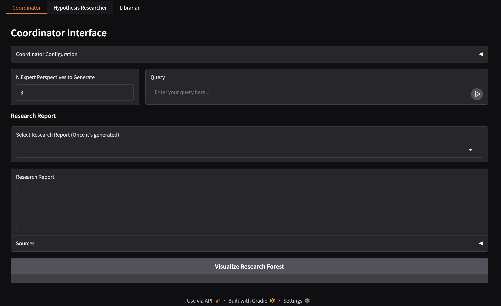
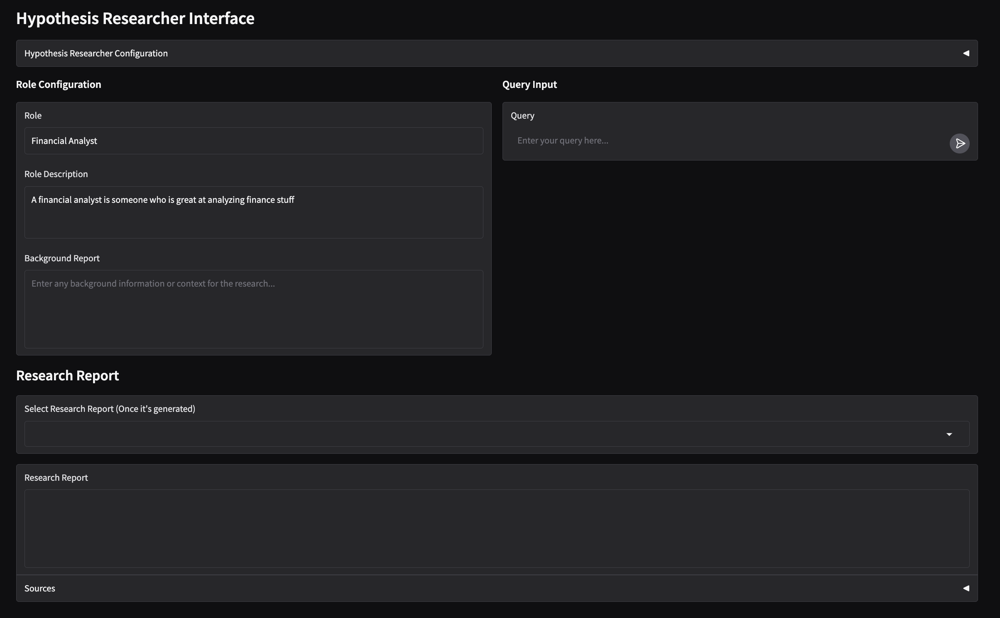
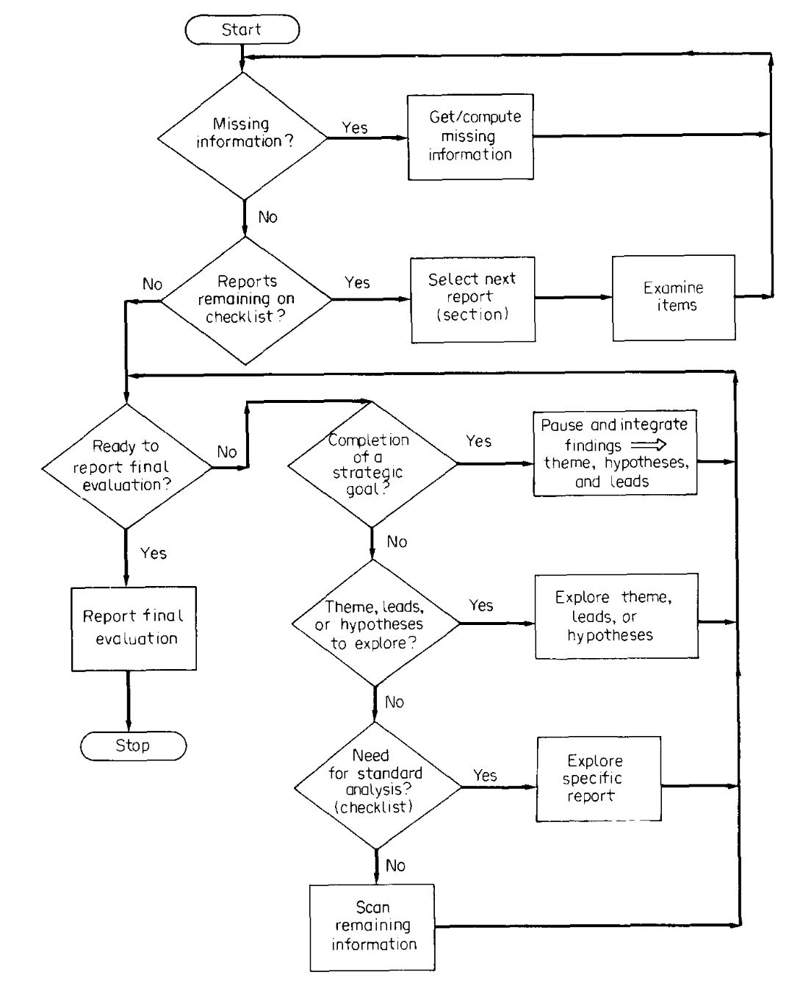

# KRUPPE

Knowledge-based Research Using Pathway and Procedural Engine

> I just wanted to named my system after a character I really like lol, the actual name doesn't real mean anything

## Test Components
#### Benchmark
 
Compare output with report generated by LLM w/ Website searching ability on the following metrics

#### Metrics

- **Comprehensiveness**: How thoroughly the system answers the financial query.
- **Diversity**: The variety of insightful perspectives provided.
- **Directness/Empowerment**: Clarity and relevance of the answers.
- **Cohesiveness**: Logical coherence and contextual consistency of the responses.

### Tests

#### 1: Set Questions

I've generated ~70 questions from different equity research reports. Test out some of these example questions

#### 2: Your Own Use Case

Think of a use case you have (i.e. questions you'd like to have answered),and test it with this sytem. Is the system helpful? Unhelpful? Where does it fall short? How does it compare to the benchmark system?

## How to Use

**IMPORTANT**: Please contact Daniel (that's me if you forgot) before trying to access the website. I need to start the server that hosts KRUPPE before you can use it.

### Coordinator

This is the main page to try out things. Simply use this tool like how you would use ChatGPT, by entering your question into "Query" and click the submit button, which will kick off the research process.

**The research process will take 10~20 minutes.** I recommend you do something else while running this lol.

After it runs, the system will generate a couple different research report, from different domain experts' perspectives. Click on the dropdown to select which report you want to see.

Once you have selected the report, you can also see the research tree process by clicking on "Visualize Research Forest".

Hyperparameters you can change:
- Model (I recommend gpt-4.1-mini)
- Max steps: the number of steps before KRUPPE says "i've tried my best, time to backtrack".
- Max Degree: the number of different messages it generates at each step. A smaller max degree will reduce the "diversity" of the output (supposedly), but speed up the program
- Available tools: the tools you would like KRUPPE to use.

### Hypothesis Researcher

Suppose you want to only answer a question from a specific perspective, you can use the "Hypothesis Researcher" page. Similarily, enter your query in the query box. However, you can customize model's research behavior by setting:
- Role: the domain expert the llm should tak eon
- Role Description: description of the domain expert
- Background: background research for the query (you can use the 'Librarian' page to help generate the background research)

The generated research reports will all be from the perspective of this "role".

### Librarian

This is the most straightforward, linear research method. Simply asks a query, and the model will generate a single answer/report for said query. You can use this to generate background research report, which can then be fed into the 'Hypothesis Researcher'.

## System Overview

### Research Strategy: Hypothesis Exploration

KRUPPE is a retrieval-augmented LLM system that attempts to improve LLM's ability to answer financial questions through a structured research process. It takes inspiration from Bouwman's 1987 paper *[How do Financial Analysts Make Decisions?](https://doi.org/10.1016/0361-3682(87)90013-4)*, and breaks down the LLM query process into two steps:
1. Background Research
2. Hypothesis Generation and Exploration

Generally, a retrieval augmented system first "retrieves" documents that are relevant to the query, then answers the query using the retrieved information. In other words, the LLM tries to look at all information relevant to a query, then creates an answer that essentially looks at *all of the above*.

KRUPPE takes a different approach. After a preliminary background research, instead of trying to immediately get all relevant information, KRUPPE first determines potential answers - or hypotheses - then explores each hypothesis by finding information that either develops it or rejects it. 

> This system emulates Bouwman's decision model: he theorized that an analyst first conducts "undirected research" to identify unique points of interest. Then, analysts use their own expertise to come up with potential hypotheses, which they can focus on developing.
> 
> 

Additionally, to encourage LLM to generate diverse answers, KRUPPE will first take on a "domain role" before generating each hypothesis. Examples of these "domain role" could be: financial analyst, semiconductor researcher, political expert, transportation manager... As a result, each hypothesis will (hopefully) focus on a different perspective, and create reports that can answer the question from a wide range of perspectives.

### Technical Framework: Research Tree
KRUPPE combines two main LLM agentic technique: ReAct and Tree of Thoughts, which I dub **Research Forest** (because why not).

The background research module follows a simple ReAct framework. It is taked to find background research for the query, and does so by always repeating "Reason" (think about what tool to call on) and "Act" (calling on the tool)

The hypothesis generation module looks at the background research report generated by the previous module, then generates a few different domain experts that should be widely different from each other. Each expert tries to create several different hypotheses that answers the question, using the information from the background research report.

Each hypothesis is developed in a "tree" like fashion, explored with Depth First Search
1. at every step, KRUPPE generates ideas on the next step to take
2. KRUPPE decides on the best next step
3. KRUPPE acts based on the best next step
4. 1-3 is repeated, until KRUPPE has determined it has developed the hypothesis enough to accept or reject it, reached a deadend (i.e. not enough information), or has gone the maximum number of steps possible. If it meets a deadend, it backtracks to the previous stage, and tries the next best step.
5. At the end, KRUPPE is asked to restate its final hypothesis, and/or generate a research hypothesis based on everything it has found.